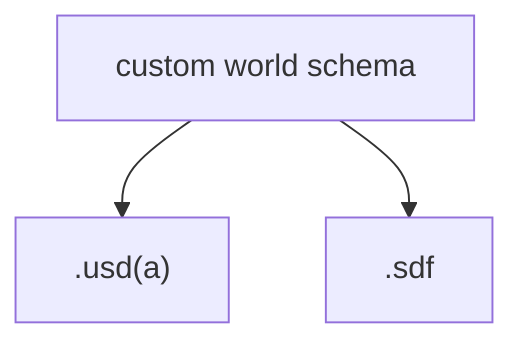

# WorldGeneration

WorldGeneration exists to provide world models for robotics development with multiple simulators. Currently supported simulators are:

- Gazebo Garden
- NVIDIA IsaacSim 4.5

While generating SDF files for Gazebo can be done entirely with XML, I use the Nvidia USD library to compose all USD(A) world files.

## About

When confronted with the problem of generating worlds (or robots - but that is a different matter), I had a few requirements:

- procedural generation of interesting worlds - which produce distributions over certain world properties
- support reinforcement learning
- eliminate hard-to-reproduce GUI-based workflows
- support multiple simulators

I originally thought I would pick a world model format (like USD, for example) and convert between formats for other simulators. This has numerous issues:

- conversion tools are ... not that good
- existing world file formats (or simulators, for that matter) are compromises - and they may be a poor compromise for your problems
- different world file formats (or simulators) are just different

So, my decision was to define my world using my own schema, then write methods to translate that schema to the required world files. In other words:

where the `custom world schema` is a collection of whatever objects or attributes is useful for my problems. Currently, this is geometric primitives, but it will soon extend to additional spatial attributes.

Note: ChatGPT4o (OpenAI, May-June 2025) accelerated the design and implementation process.

## Requirements

This code requires a USD python library for the translation to USD and USDA. I used the prebuilt NVIDIA USD library, installed via:

[nvidia usd](https://developer.nvidia.com/usd?sortBy=developer_learning_library%2Fsort%2Ffeatured_in.usd_resources%3Adesc%2Ctitle%3Aasc&hitsPerPage=6)

You can also install usd via pypi (see the link). Searching the nvidia developer pages for up-to-date options is advisable. It is unclear how much special NVIDIA sauce is needed in the USD library to support IsaacSim world definition.

After installing USD in the binary manner, I used PYTHONPATH to extend my python interpreter so it could use the installed version of USD. See the file `env.sh`. I also use a conda env for this repo - based on python 3.11.

See also: 
- [environment.yml](environment.yml)

## Usage

Currently, all code is run from the unit test: `test_gpy.py`. This will evolve.

### World generation

TODO

